# Challenge-06

<h1>Diferentes configuraciones necesarias para comenzar el proyecto.</h1>

<ol>
  <li>Sistema de input nuevo de Unity.</li>
  <li>Editor de código de su preferencia configurado en la configuración de su proyecto en Unity.</li>
  <li>Paquete de ProBuilder.</li>
  <li>Paquete "Sci-Fi Styled Modular Pack".</li>
  <li>Paquete "SciFi Warrior PBRHPP Polyart".</li>
  <li>Scripts configurados para que el jugador se mueva horizontal y verticalmente además de disparar al presionar click izquierdo.</li>
  
</ol>

 Comenzamos eligiendo un <code>Asset</code> de alguno de los paquetes que importamos para utilizarlo en el piso. A su vez le añadimos un <code>script</code> que se llame <code>floor</code>.

<image
  src="challenge06/floor.png"
  width = 60%
  height = 60%>

Duplicando los prefabs para tener en nuestro cuadrado <code>4x4</code>. Nuestra escena se vería asi:

<image
  src="challenge06/preHecho.png"
  width = 60%
  height = 60%>

Creamos un <code>Empty object</code> llamado <code>FloorManager</code> y para organizarlos ponemos todos los pisos bajo la jerarquía de este.

<image
  src="challenge06/floorManager1.png"
  width = 30%
  height = 30%>

También le añadimos un <Code>Script</Code> llamado <code>FloorManager</code>. Más adelante se encuentran las especificidades de este script.

<image
  src="challenge06/floorManager2.png"
  width = 60%
  height = 60%>

Repetimos un proceso similar, pero con las paredes. Elegimos el prefab del paquete que queremos utilizar para nuestras paredes. Además le añadimos un <code>Script</code> llamado <code>Life</code>. 

<image
  src="challenge06/pared2.png"
  width = 60%
  height = 60%>

  <image
  src="challenge06/pared1.png"
  width = 60%
  height = 60%>

Para que pueda sensar las balas que impactan debemos añadir el <code>Rigid body</code> y marcar el encasillado de <code>Is Kinematic</code>. 

<image
  src="challenge06/pared3.rigid.png"
  width = 60%
  height = 60%>

Creamos una esfera que será el prefab de nuestra bala del jugador y añadimos los siguientes componenetes.

<image
  src="challenge06/bullet1.png"
  width = 50%
  height = 50%>

En el script de <code>Contact Damager</code> realizamos los siguientes cambios.

<image
  src="challenge06/contactDamager.png"
  width = 60%
  height = 60%>

El scipt llamado <code>Floor Manager</code> tenemos este código para tener una lista en la que se encuentren todos los pisos.

<image
  src="challenge06/floorManager.png"
  width = 60%
  height = 60%>

Añadimos un método público para eliminar un piso aleatorio de la lista.

<image
  src="challenge06/removeRandomFloor.png"
  width = 60%
  height = 60%>

Para elegir de manera aleatoria el índice de la lista que le corresponde a cada pared, añadimos este código el script llamado <code>Life</code>.

<image
  src="challenge06/life.png"
  width = 60%
  height = 60%>

En esta animación puede verse en práctica como al dispararle a una pared se destruye un piso y al disparar a otra se destruye otro piso.

<image
  src="ParedIndex.gif"
  width = 60%
  height = 60%>

Repetimos en cierta medida el proceso de la pared ahora para que al impactar las esquinas se destruyan todos los pisos.

Elegimos prefab y añadimos componentes.

<image
  src="challenge06/corner.png"
  width = 60%
  height = 60%>

En el script <code>Contact Damager</code> añadimos el siguiente código.

<image
  src="challenge06/corner2.png"
  width = 60%
  height = 60%>

En el script <code>Life</code> añadimos el siguiente código.

<image
  src="challenge06/corner3.png"
  width = 60%
  height = 60%>

En el script llamado <code>Floor Manager</code> añadimos un método para que se eliminen todos los pisos al chocar con una esquina.

<image
  src="challenge06/floorManager.corner4.png"
  width = 60%
  height = 60%>

<h2>Creando al enemigo</h2>

Creamos el prefab del enemigo con todos sus componentes necesarios.

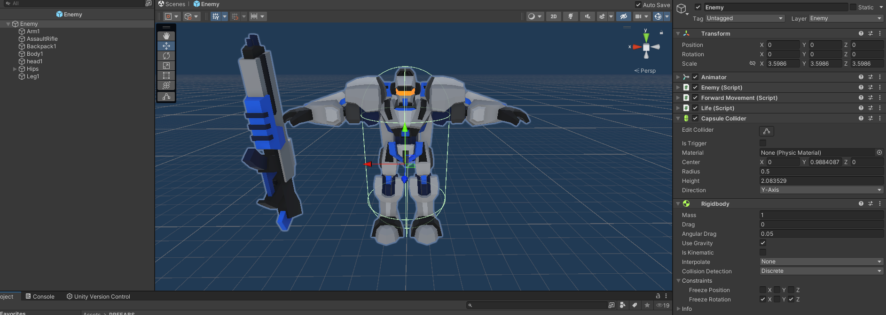

Le damos un script al enemigo, llamado <code>Enemy</code>. Note que el <code>EnemyManager</code> aún no ha sido creado, pero no nos preocupemos por esto. ;) 

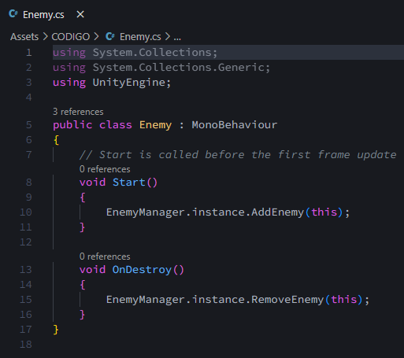

Añadimos otros scripts necesarios para el enemigo.

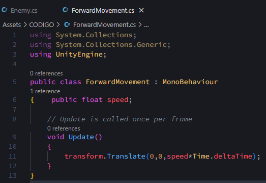
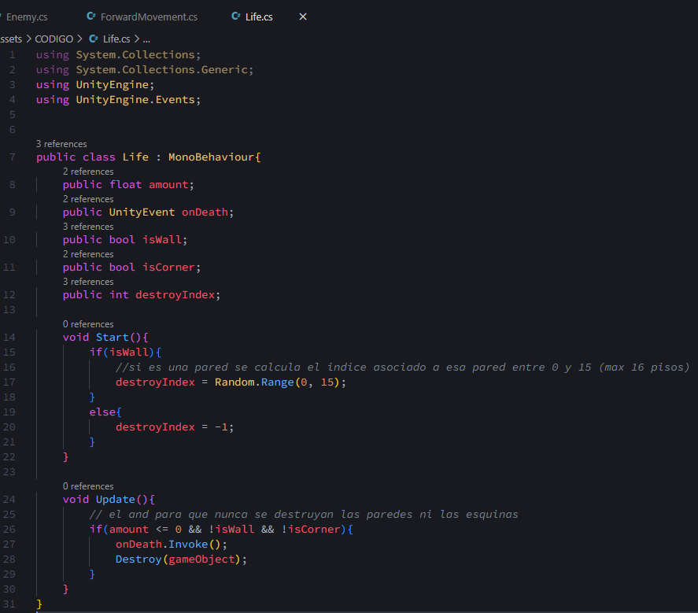

<h2>Manejando la aparición de los enemigos</h2>

Ahora queremos crear los "spawners" de los enemigos para que aparezcan de diferentes posiciones y caminen en direcciones distintas. Además, crearemos un <code>Wave Manager</code> y un <code>Enemy Manager</code> que será importante posteriormente para manejar las condiciones de victoria y pérdida.

Creamos los "spawners"...

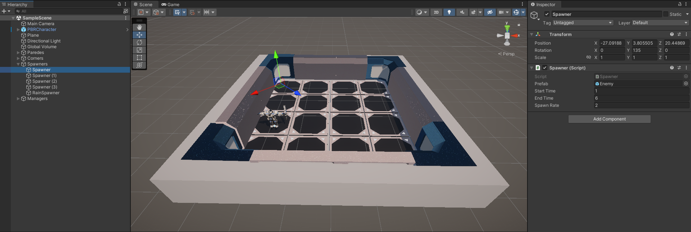
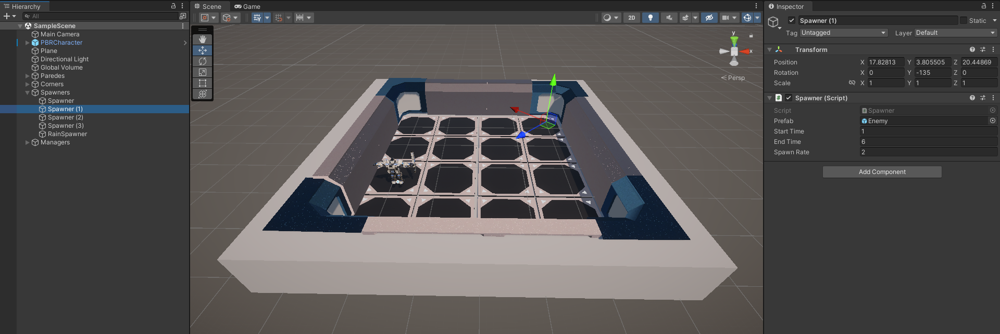
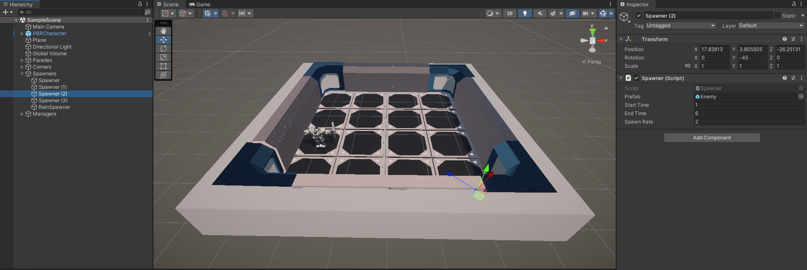

Creamos el <code>Wave Manager</code>...

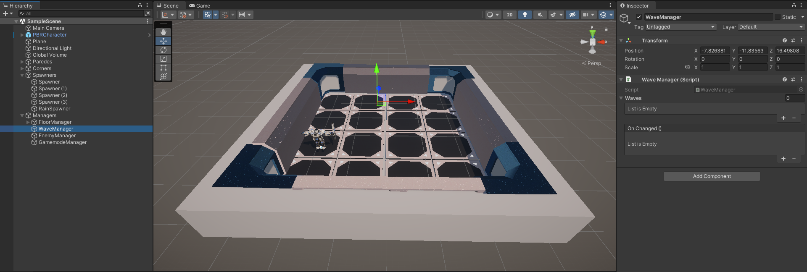

Asignamos los scripts correspondientes...

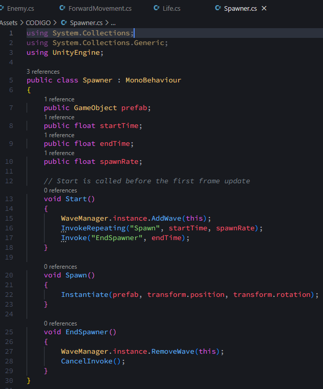
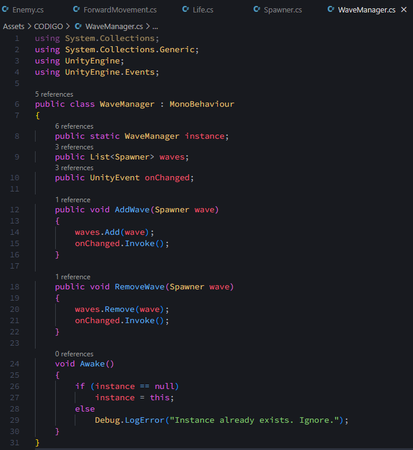

...y creamos el <code>Enemy Manager</code> con su script.

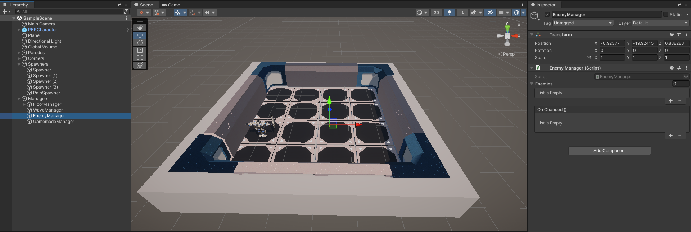
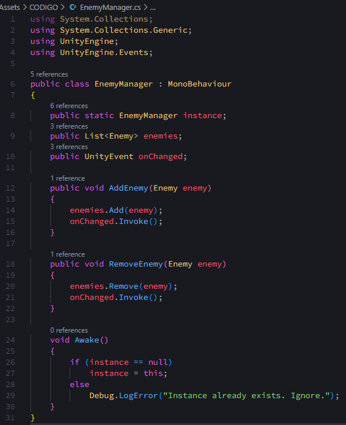

<h2>"Make it rain!"</h2>

Antes de mostrar el resultado, añadiremos otro toque especial a nuestro juego: ¡lluvia!

Creamos un prefab que simulará una "gota" que caerá del cielo. Creamos su material y su prefab con las siguientes características:

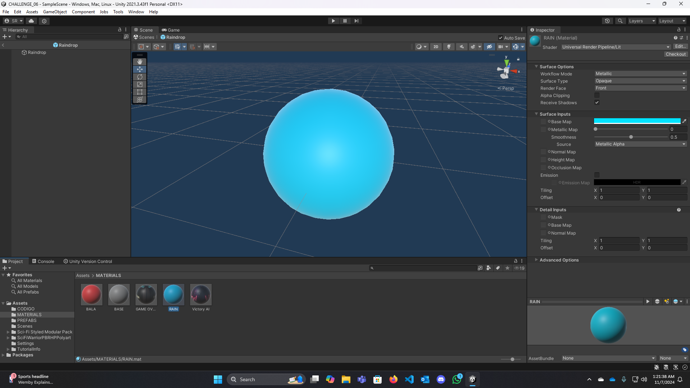
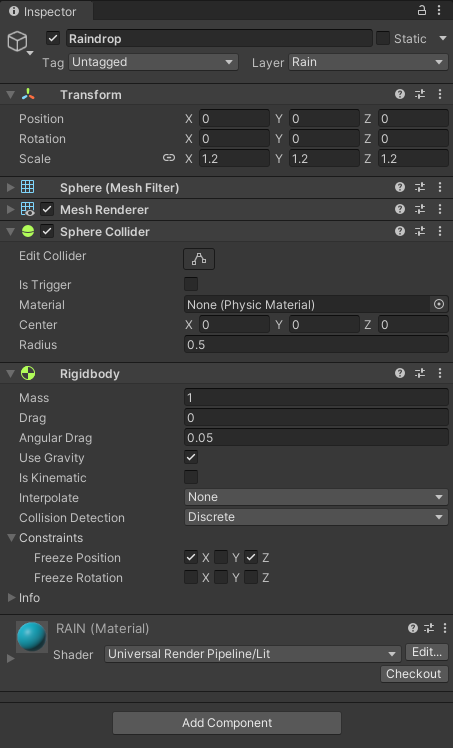

Ahora, la parte más importante es lograr que las gotas de agua aparezcan rápidamente en <bold>distintas</bold> partes del mapa. Para esto, creamos un nuevo objeto vacío al que llamaremos <code>Rain Spawner</code>. Este se encargará de todas las gotas de lluvia.

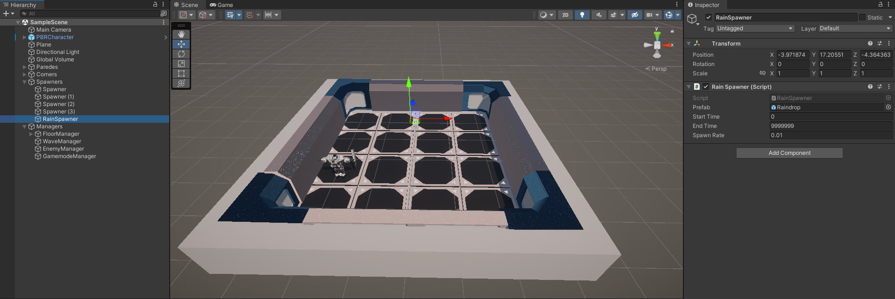

Aquí creamos un script similar al del <code>Spawner</code> de los enemigos, pero con una adición: cada vez que se genera una gota, también se tiene que generar una posición aleatoria en su X y Z que se encuentre dentro del área del campo de batalla. A continuación, hay una implementación bastante simple de esta función:

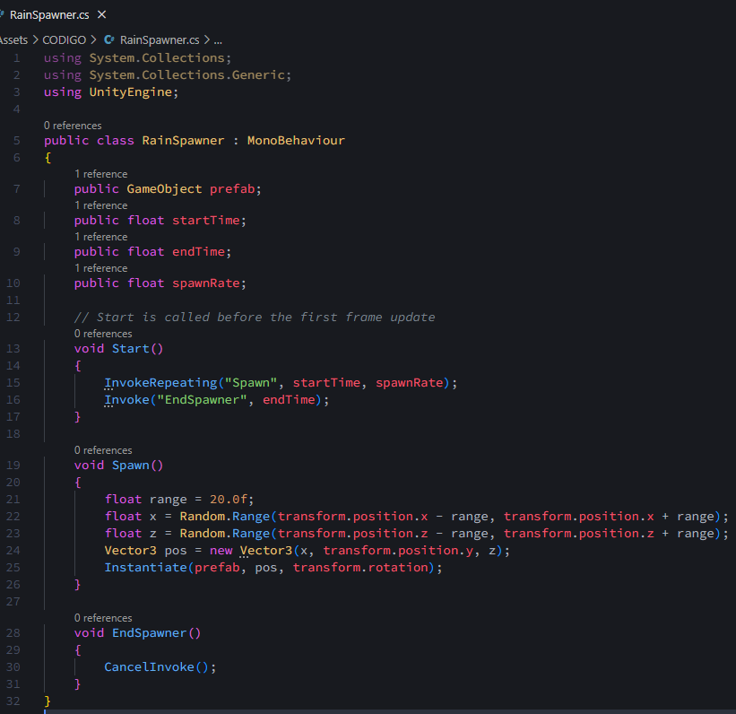

¡Veamos cómo cae la lluvia!

